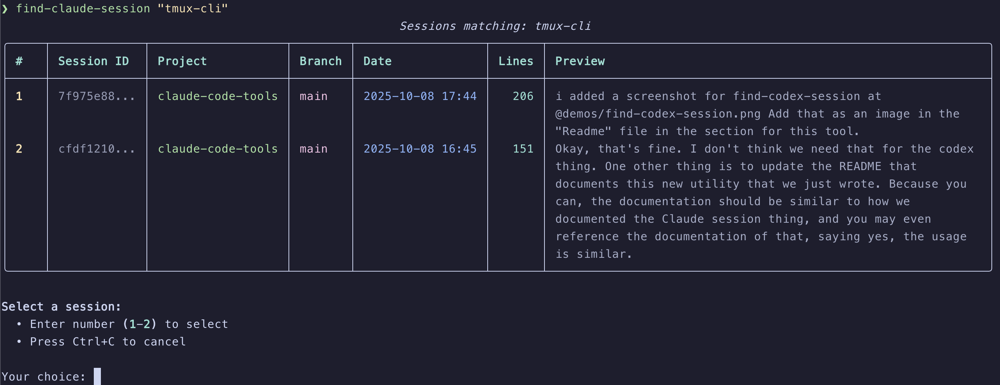
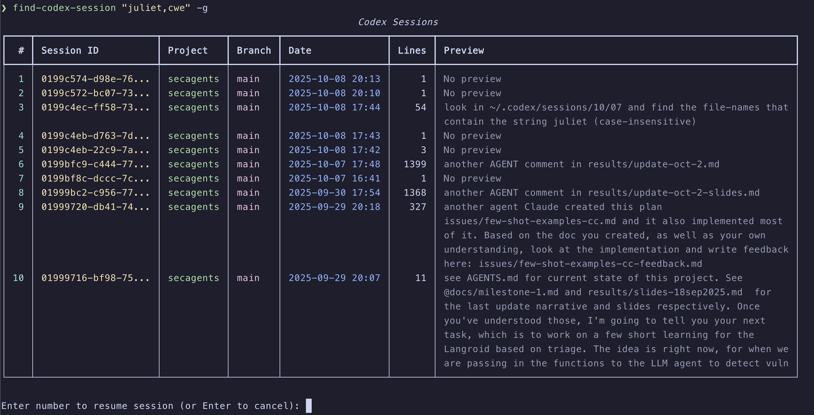

# claude-code-tools

A collection of practical tools, hooks, and utilities for enhancing Claude Code
and other CLI coding agents.

## Table of Contents

- [🎮 tmux-cli: Bridging Claude Code and Interactive CLIs — "playwright for the terminal"](#tmux-cli-bridging-claude-code-and-interactive-clis)
- [🚀 Quick Start](#quick-start)
- [🎮 tmux-cli Deep Dive](#tmux-cli-deep-dive)
- [🚀 lmsh (Experimental) — natural language to shell commands](#lmsh-experimental)
- [🔍 find-session — unified search across Claude & Codex sessions](#find-session)
- [🔍 find-claude-session — search and resume Claude sessions](#find-claude-session)
- [🔍 find-codex-session — search and resume Codex sessions](#find-codex-session)
- [🗜️ trim-session — compress session files for context management](#trim-session)
- [🤖 smart-trim (EXPERIMENTAL) — intelligent trimming using parallel Claude SDK agents](#smart-trim-experimental)
- [📄 export-claude-session — export Claude sessions using built-in format](#export-claude-session)
- [📄 export-codex-session — export Codex sessions using built-in format](#export-codex-session)
- [📍 find-original-session — trace trimmed sessions to their source](#find-original-session)
- [🌳 find-trimmed-sessions — find all trimmed versions of a session](#find-trimmed-sessions)
- [🔐 vault — encrypted .env backup & sync](#vault)
- [🔍 env-safe — inspect .env safely without values](#env-safe)
- [🛡️ Claude Code Safety Hooks — guardrails for bash, git, env, files](#claude-code-safety-hooks)
- [🤖 Using Claude Code with Open-weight Anthropic API-compatible LLM Providers](#using-claude-code-with-open-weight-anthropic-api-compatible-llm-providers)
- [📚 Documentation](#documentation)
- [📋 Requirements](#requirements)
- [🛠️ Development](#development)
- [📄 License](#license)

<a id="tmux-cli-bridging-claude-code-and-interactive-clis"></a>
## 🎮 tmux-cli: Bridging Claude Code and Interactive CLIs

> **Note**: While the description below focuses on Claude Code, tmux-cli works with any CLI coding agent.

 

Consider these scenarios:

You're using Claude Code (CC) to build an interactive script. The script prompts 
for user input, but CC can't respond to prompts.

You want Claude Code to debug using pdb, stepping through code line by line.

You need your CLI code agent to launch another instance of the same OR different 
CLI code agent, AND interact with it, not as a hidden sub-agent, 
but as a visible session you can monitor (as shown in gif above).

**tmux-cli enables these workflows** by giving Claude Code programmatic control 
over terminal applications.

For those new to [tmux](https://github.com/tmux/tmux/wiki), it's a terminal 
multiplexer that lets you create and manage multiple terminal sessions. The key 
benefit for our purposes is that tmux is scriptable and allows sending keystrokes 
to specific panes or sessions programmatically.

**Important**: You don't need to learn tmux-cli commands. Claude Code will handle 
all the interactions automatically. Just tell CC what you want to do, and it will 
use tmux-cli behind the scenes.

**Think Playwright for terminals** - Terminal automation for AI agents.

**Works anywhere**: Automatically handles both local tmux panes and remote sessions.

<a id="quick-start"></a>
## 🚀 Quick Start

```bash
# Install from PyPI (recommended)
uv tool install claude-code-tools

# Or install the latest development version from GitHub
uv tool install git+https://github.com/pchalasani/claude-code-tools
```

This gives you:
- `tmux-cli` - The interactive CLI controller we just covered
- `find-session` - Unified search across Claude Code and Codex sessions
- `find-claude-session` - Search and resume Claude Code sessions by keywords
- `find-codex-session` - Search and resume Codex sessions by keywords
- `trim-session` - Compress session files by trimming large tool results and assistant messages
- `smart-trim` - (EXPERIMENTAL) Intelligent trimming using parallel Claude SDK agents
- `export-claude-session` - Export Claude sessions using Claude Code's built-in format
- `export-codex-session` - Export Codex sessions using Claude Code's built-in format
- `find-original-session` - Trace trimmed sessions back to their original source
- `find-trimmed-sessions` - Find all trimmed descendants of a session
- `vault` - Encrypted backup for your .env files
- `env-safe` - Safely inspect .env files without exposing values

<a id="tmux-cli-deep-dive"></a>
## 🎮 tmux-cli Deep Dive

### What Claude Code Can Do With tmux-cli

1. **Test Interactive Scripts** - CC can run and interact with scripts that 
   require user input, answering prompts automatically based on your instructions.

2. **UI Development & Testing** - CC can launch web servers and coordinate with 
   browser automation tools to test your applications.

3. **Interactive Debugging** - CC can use debuggers (pdb, node inspect, gdb) to 
   step through code, examine variables, and help you understand program flow.

4. **Claude-to-Claude Communication** - CC can launch another Claude Code instance 
   to get specialized help or code reviews.

Claude Code knows how to use tmux-cli through its built-in help. You just describe 
what you want, and CC handles the technical details.

For complete command reference, see [docs/tmux-cli-instructions.md](docs/tmux-cli-instructions.md).

### Setting up tmux-cli for Claude Code

To enable CC to use tmux-cli, add this snippet to your global
`~/.claude/CLAUDE.md` file:

```markdown
# tmux-cli Command to interact with CLI applications

`tmux-cli` is a bash command that enables Claude Code to control CLI applications 
running in separate tmux panes - launch programs, send input, capture output, 
and manage interactive sessions. Run `tmux-cli --help` for detailed usage 
instructions.

Example uses:
- Interact with a script that waits for user input
- Launch another Claude Code instance to have it perform some analysis or review or 
  debugging etc
- Run a Python script with the Pdb debugger to step thru its execution, for 
  code-understanding and debugging
- Launch web apps and test them with browser automation MCP tools like Playwright or 
Chrome Dev Tools.
```

More frequently, I use this method: I launch another CLI-agent (say Codex-CLI) 
in another tmux pane, and say something like this to the first agent:

> There's another coding agent "Codex" running in tmux Pane 3. Feel free to use Codex 
to help you with your task or review your work. You can communicate with Codex using
the tmux-cli command; you can do tmu-cli --help to see how to use it.


For detailed instructions, see [docs/tmux-cli-instructions.md](docs/tmux-cli-instructions.md).

All of this assumes you're familiar and comfortable with tmux, and (like me) run 
all CLI coding sessions inside tmux sessions.

<a id="lmsh-experimental"></a>
## 🚀 lmsh (Experimental)

Natural language shell - type what you want in plain English, get an editable command.

```bash
# Direct usage - translate, edit, execute, then enter interactive mode
$ lmsh "show me all python files modified today"
find . -name "*.py" -mtime 0  # <-- Edit before running

# Or interactive mode
$ lmsh
lmsh> show recent docker containers
docker ps -n 5  # <-- Edit before running
```

**Features:**
- Rust-based for instant startup (<1ms binary load time)
- Translates natural language to shell commands using Claude Code CLI
- Commands are editable before execution - full control
- Preserves your shell environment

**Note:** Requires Claude Code CLI (`claude` command) to be installed. The translation adds ~2-3s due to Claude Code CLI startup.

**Installation:**
```bash
# Install from crates.io (easiest, requires Rust)
cargo install lmsh

# Or build from source
cd lmsh && cargo build --release
cp target/release/lmsh ~/.cargo/bin/
# Or: make lmsh-install
```

See [docs/lmsh.md](docs/lmsh.md) for details.

<a id="find-session"></a>
## 🔍 find-session

**Unified session finder** - Search across both Claude Code and Codex sessions simultaneously.

### Setup (Recommended)

Add this function to your shell config (.bashrc/.zshrc) for persistent directory changes:

```bash
fs() {
    # Check if user is asking for help
    if [[ "$1" == "--help" ]] || [[ "$1" == "-h" ]]; then
        find-session --help
        return
    fi
    # Run find-session in shell mode and evaluate the output
    eval "$(find-session --shell "$@" | sed '/^$/d')"
}
```

Or source the provided function:
```bash
source /path/to/claude-code-tools/scripts/fs-function.sh
```

**Why use the shell wrapper?** When you resume a session from a different directory, the wrapper ensures the directory change persists after the session exits. Without it, you'll be back in your original directory after exiting the session (though the session itself runs in the correct directory).

### Usage

```bash
# Search all agents in current project
fs "keyword1,keyword2"

# Show all sessions across all agents in current project
fs

# Search across all projects (Claude + Codex)
fs "keywords" -g

# Show all sessions across all projects
fs -g

# Search only specific agent(s)
fs "bug,fix" --agents claude
fs "error" --agents codex

# Limit number of results
fs "keywords" -n 15

# Show only original (non-trimmed) sessions
fs "keywords" --original
fs -g --original
```

### Features

- **Multi-agent search**: Searches both Claude Code and Codex sessions simultaneously
- **Unified display**: Single table showing sessions from all agents with agent column
- **Session indicators**:
  - Star (*) next to trimmed sessions
  - "(sub)" next to sub-agent sessions (created by Task tool, not directly resumable)
  - Explanatory footnotes for both indicators
- **Original session filtering**: Use `--original` flag to show only non-trimmed
  sessions
- **Smart resume**: Automatically uses correct CLI tool (`claude` or `codex`) based on selected session
- **Persistent directory changes**: Using the `fs` wrapper ensures you stay in the session's directory after exit
- **Optional keyword search**: Keywords are optional—omit them to show all sessions
- **Action menu** after session selection:
  - **For normal sessions**: Full menu with resume options
    - Resume as-is (default)
    - Trim session (heuristic) and resume trimmed copy
    - Smart trim (EXPERIMENTAL - using Claude SDK agents) and resume
    - Show session file path
    - Copy session file
    - Clone and resume
    - Export to text file (.txt) (Claude and Codex sessions)
  - **For sub-agent sessions**: Limited menu (resume not available)
    - Show session file path
    - Copy session file
    - Export to text file (.txt) (Claude sessions only - Codex has no sub-agents)
- **Project filtering**: Search current project only (default) or all projects with `-g`
- **Agent filtering**: Use `--agents claude codex` to search specific agents only
- **Configurable**: Optional config file at `~/.config/find-session/config.json` for customizing agents
- Interactive session selection with Rich table display
- Shows agent, project, git branch, date, line count, and preview
- Reverse chronological ordering (most recent first)
- Press Enter to cancel (no need for Ctrl+C)

Note: You can also use `find-session` directly, but directory changes won't persist after exiting sessions.

### Configuration (Optional)

Create `~/.config/find-session/config.json` to customize agent settings:

```json
{
  "agents": [
    {
      "name": "claude",
      "display_name": "Claude",
      "home_dir": "~/.claude",
      "enabled": true
    },
    {
      "name": "codex",
      "display_name": "Codex",
      "home_dir": "~/.codex",
      "enabled": true
    }
  ]
}
```

This allows you to:
- Enable/disable specific agents
- Override default home directories
- Customize display names
- Prepare for future agent additions

<a id="find-claude-session"></a>
## 🔍 find-claude-session

Search and resume Claude Code sessions by keywords with an interactive UI.

### Setup (Recommended)

Add this function to your shell config (.bashrc/.zshrc) for persistent directory
changes:

```bash
fcs() {
    # Check if user is asking for help
    if [[ "$1" == "--help" ]] || [[ "$1" == "-h" ]]; then
        find-claude-session --help
        return
    fi
    # Run find-claude-session in shell mode and evaluate the output
    eval "$(find-claude-session --shell "$@" | sed '/^$/d')"
}
```

Or source the provided function:
```bash
source /path/to/claude-code-tools/scripts/fcs-function.sh
```

### Usage

```bash
# Search in current project
fcs "keyword1,keyword2,keyword3"

# Show all sessions in current project (no keyword filtering)
fcs

# Search across all Claude projects
fcs "keywords" --global
fcs "keywords" -g

# Show all sessions across all projects
fcs -g

# Show only original (non-trimmed) sessions
fcs "keywords" --original
fcs -g --original
```

### Features

- **Optional keyword search**: Keywords are optional—omit them to show all sessions
- **Session indicators**:
  - Star (*) next to trimmed sessions
  - "(sub)" next to sub-agent sessions (created by Task tool, not directly resumable)
  - Explanatory footnotes for both indicators
- **Original session filtering**: Use `--original` flag to show only non-trimmed
  sessions
- **Action menu** after session selection:
  - **For normal sessions**: Full menu with resume options
    - Resume as-is (default)
    - Trim session (heuristic) and resume trimmed copy
    - Smart trim (EXPERIMENTAL - using Claude SDK agents) and resume
    - Show session file path
    - Copy session file
    - Clone and resume
    - Export to text file (.txt)
  - **For sub-agent sessions**: Limited menu (resume not available)
    - Show session file path
    - Copy session file
    - Export to text file (.txt)
- Interactive session selection with previews
- Cross-project search capabilities (local by default, `-g` for global)
- Shows last user message preview (filtered, multi-line wrapping)
- Automatic session resumption with `claude -r`
- Persistent directory changes when resuming cross-project sessions
- Press Enter to cancel (no need for Ctrl+C)

Note: You can also use `find-claude-session` directly, but directory changes
won't persist after exiting Claude Code.

For detailed documentation, see [docs/find-claude-session.md](docs/find-claude-session.md).

Looks like this --



<a id="find-codex-session"></a>
## 🔍 find-codex-session

Search and resume Codex sessions by keywords. Usage is similar to `find-claude-session` above, but works with Codex session files instead.

### Key Differences from find-claude-session

- Searches `~/.codex/sessions/` (organized by YYYY/MM/DD directories)
- Extracts metadata from `session_meta` entries in Codex JSONL files
- Resumes sessions with `codex resume <session-id>`

### Setup (Recommended)

Add this function to your shell config (.bashrc/.zshrc) for persistent directory changes:

```bash
fcs-codex() {
    # Check if user is asking for help
    if [[ "$1" == "--help" ]] || [[ "$1" == "-h" ]]; then
        find-codex-session --help
        return
    fi
    # Run find-codex-session in shell mode and evaluate the output
    eval "$(find-codex-session --shell "$@" | sed '/^$/d')"
}
```

Or source the provided function:
```bash
source /path/to/claude-code-tools/scripts/fcs-codex-function.sh
```

### Usage

```bash
# Search in current project only (default)
fcs-codex "keyword1,keyword2"

# Show all sessions in current project (no keyword filtering)
fcs-codex

# Search across all projects
fcs-codex "keywords" -g
fcs-codex "keywords" --global

# Show all sessions across all projects
fcs-codex -g

# Limit number of results
fcs-codex "keywords" -n 5

# Custom Codex home directory
fcs-codex "keywords" --codex-home /custom/path

# Show only original (non-trimmed) sessions
fcs-codex "keywords" --original
fcs-codex -g --original
```

### Features

- **Optional keyword search**: Keywords are optional—omit them to show all sessions
- **Trimmed session indicator**: Star (*) next to trimmed sessions with explanatory
  footnote (Note: Codex doesn't have sub-agent sessions like Claude Code)
- **Original session filtering**: Use `--original` flag to show only non-trimmed
  sessions
- **Action menu** after session selection:
  - Resume as-is (default)
  - Trim session (heuristic) and resume trimmed copy
  - Smart trim (EXPERIMENTAL - using sub-agents) and resume
  - Show session file path
  - Copy session file
  - Clone and resume
  - Export to text file (.txt)
- **Project filtering**: Search current project only (default) or all projects with `-g`
- Case-insensitive AND keyword search across all session content
- Interactive session selection with Rich table display
- Shows project name, git branch, date, line count, and preview of last user message
- Automatic session resumption with `codex resume`
- Cross-project session support with directory change prompts
- Reverse chronological ordering (most recent first)
- Multi-line preview wrapping for better readability
- Press Enter to cancel (no need for Ctrl+C)

Note: You can also use `find-codex-session` directly, but directory changes won't persist after exiting Codex.

Looks like this --



<a id="trim-session"></a>
## 🗜️ trim-session

Compress Claude Code and Codex session files by trimming large tool results
and assistant messages. This is especially useful for managing sessions that are
approaching the context window limit or compaction threshold.

### Why trim-session?

When working on complex tasks, Claude Code and Codex sessions can accumulate
large tool outputs—file contents, bash command results, search results, etc.
These outputs can push your session close to the context limit, triggering
automatic compaction. By selectively trimming large tool results and assistant
messages, you can:

- **Extend conversation length**: Reclaim thousands of tokens by replacing
  verbose tool outputs and messages with concise placeholders
- **Resume conversations efficiently**: Continue working on a task without
  hitting context limits
- **Preserve conversation flow**: Keep the structure and reasoning intact while
  removing redundant data
- **Target specific tools**: Choose which types of tool results to trim
  (e.g., only large file reads)
- **Trim early assistant messages**: Remove verbose explanations from early
  in the conversation while keeping recent context

### Usage

```bash
# Trim all tool results over 500 characters (default, auto-detect agent)
trim-session session.jsonl

# Specify agent type explicitly (Claude Code or Codex)
trim-session session.jsonl --agent claude
trim-session session.jsonl --agent codex

# Trim only specific tools (e.g., file operations)
trim-session session.jsonl --tools read,edit,bash

# Use custom length threshold (e.g., 1000 characters)
trim-session session.jsonl --len 1000

# Trim Task tool results over 1000 chars
trim-session session.jsonl --tools task --len 1000

# Trim first 5 assistant messages (keep tool results)
trim-session session.jsonl --trim-assistant-messages 5

# Trim all assistant messages except last 3 (negative number)
trim-session session.jsonl --trim-assistant-messages -3

# Combine: trim tools AND first 10 assistant messages
trim-session session.jsonl --len 1000 --trim-assistant-messages 10

# Custom output directory
trim-session session.jsonl --output-dir ~/compressed-sessions
```

### How it works

The tool processes your session file and replaces large tool results and
assistant messages with informative placeholders:

**Tool results - Before:**
```
[6,708 characters of detailed file exploration results]
```

**Tool results - After:**
```
[Results from Task tool trimmed - original content was 6,708 characters]
```

**Assistant messages - Before:**
```
[Long assistant explanation with detailed reasoning...]
```

**Assistant messages - After:**
```
[Assistant message trimmed - original content was 2,431 characters]
```

The output file is named appropriately for the agent type:
- **Claude Code**: `{uuid}.jsonl` - Resume with `claude -r <session-uuid>`
- **Codex**: `rollout-{timestamp}-{uuid}.jsonl` in dated directory - Resume
  with `codex resume <session-uuid>`

### Features

- **Multi-agent support**: Works with both Claude Code and Codex sessions
- **Automatic agent detection**: Auto-detects agent type from session format
- **Flexible filtering**: Trim all tools or target specific ones (bash,
  read, edit, task, etc.)
- **Assistant message trimming**: Optionally trim first N or all except last N
  assistant messages
- **Configurable threshold**: Set minimum size for trimming (default: 500
  characters)
- **Trim metadata tracking**: Adds metadata to first line tracking parent file,
  trim parameters, and statistics
- **Token estimates**: Shows estimated tokens saved using standard heuristics
  (~4 chars per token)
- **Resume-compatible**: Output files work seamlessly with `claude -r` and
  `codex resume`
- **Non-destructive**: Original session files remain unchanged
- **Detailed statistics**: Reports number of results trimmed, characters
  saved, and estimated tokens saved

### Example output

```
======================================================================
TRIM SUMMARY
======================================================================
Tool results trimmed: 55
Assistant messages trimmed: 8
Characters saved: 268,449
Estimated tokens saved: 67,112

Output file: ai-chats/4e470f01-706e-496b-95d3-b1d93db8b5f8.jsonl

Session UUID:
4e470f01-706e-496b-95d3-b1d93db8b5f8
======================================================================
```

### When to use

- **Before hitting context limits**: Proactively compress sessions when they
  grow large
- **After exploratory work**: Clean up sessions after extensive file reading
  or code exploration
- **For long-running tasks**: Maintain session viability across multiple work
  sessions
- **When resuming old sessions**: Refresh old sessions by removing outdated
  tool outputs

### Available tool types

Common tools you can target with `--tools`:
- `task` - Sub-agent results (often the largest)
- `read` - File contents
- `bash` - Shell command outputs
- `edit` - File edit results
- `glob` - File search results
- `grep` - Content search results

<a id="smart-trim-experimental"></a>
## 🤖 smart-trim (EXPERIMENTAL)

**Intelligent session trimming using parallel Claude SDK agents.** Unlike `trim-session` which uses simple heuristics (length thresholds), `smart-trim` uses multiple Claude SDK agents running in parallel to analyze your session content and intelligently determine what can be safely trimmed.

⚠️ **EXPERIMENTAL**: This tool is in active development. The parallel Claude SDK agents make independent trimming decisions for different chunks of your session, which means they cannot fully account for cross-chunk dependencies. Use with caution and review results before resuming trimmed sessions.

### How it works

1. **Parallel Analysis**: Splits your session into chunks and launches multiple Claude SDK agents in parallel
2. **Intelligent Content Extraction**: Agents see only relevant content (text, tool results), not metadata or thinking blocks
3. **Smart Decisions**: Each agent identifies verbose tool results, redundant explanations, and intermediate debugging output
4. **Protected Content**: Automatically preserves user messages, head/tail messages (configurable), file-history-snapshots, thinking blocks, and critical context

### Usage

```bash
# Analyze and trim a session (auto-detect agent type)
smart-trim session.jsonl

# Use verbose mode to see trimming rationales
smart-trim session.jsonl --verbose

# Configure chunk size for parallel agents (default: 100 lines)
smart-trim session.jsonl --max-lines-per-agent 50

# Adjust content threshold (default: 200 chars)
smart-trim session.jsonl --content-threshold 300

# Preserve messages at the beginning of the session
smart-trim session.jsonl --preserve-head 10

# Preserve messages at the end of the session
smart-trim session.jsonl --preserve-tail 20

# Combine: preserve both head and tail
smart-trim session.jsonl --preserve-head 5 --preserve-tail 15

# Legacy option: preserve recent messages (deprecated, use --preserve-tail)
smart-trim session.jsonl --preserve-recent 20

# Exclude additional message types
smart-trim session.jsonl --exclude-types user,tool_result

# Dry run - see what would be trimmed without doing it
smart-trim session.jsonl --dry-run
```

### Key Features

- **Multi-agent support**: Works with both Claude Code and Codex sessions (new and old formats)
- **Parallel processing**: Launches multiple Claude SDK agents to analyze large sessions efficiently
- **Context-aware**: Preserves thinking blocks, file-history-snapshots, and system messages that don't count toward context
- **Content-focused**: Extracts only relevant text/code from nested JSON structures
- **Verbose mode**: See detailed rationales for every trimmed line
- **Configurable**: Tune chunk size, content threshold, and preservation parameters
- **Flexible preservation**: Protect first N messages (`--preserve-head`) and/or last N messages (`--preserve-tail`) from trimming
- **Trim metadata tracking**: Adds metadata to track parent session, trim parameters, and statistics for session lineage

### Limitations

⚠️ **Important**: Each Claude SDK agent analyzes its chunk independently and cannot see content from other chunks. This means:

- Agents may trim content that is referenced in later parts of the session
- Cross-chunk dependencies cannot be detected
- For critical sessions, review the verbose output before resuming

Future versions may implement multi-pass analysis or cross-agent communication to address these limitations.

### Integration with find-session tools

Smart-trim is integrated into `find-claude-session` and `find-codex-session`. When you select a session to resume, you'll see option 3:

```
Resume options:
1. Default, just resume as is (default)
2. Trim session (tool results + assistant messages) and resume
3. Smart trim (EXPERIMENTAL - using Claude SDK agents) and resume
```

Choosing option 3 will:
- Launch parallel Claude SDK agents to analyze your session
- Create a new trimmed session with a fresh UUID
- Automatically resume the trimmed session
- Show token savings and trimming statistics

### Example Output

```
🤖 Smart trimming session using parallel Claude SDK agents...
   This may take a minute as agents analyze the session...
   Found 88 lines to trim

======================================================================
✅ SMART TRIM COMPLETE
======================================================================
📁 New session file created:
   ~/.claude/ai-chats/4e470f01-706e-496b-95d3-b1d93db8b5f8.jsonl
🆔 New session UUID: 4e470f01-706e-496b-95d3-b1d93db8b5f8
📊 Trimmed 88 lines, saved ~42,820 tokens

🚀 Resuming smart-trimmed session: 4e470f01-706e...
======================================================================
```

<a id="export-claude-session"></a>
## 📄 export-claude-session

Export Claude Code sessions using Claude Code's built-in export format. This tool extracts the essential conversation content while filtering out thinking blocks, system messages, and other metadata that doesn't contribute to understanding the conversation flow.

### Usage

```bash
# Export a session by file path
export-claude-session /path/to/session.jsonl --output summary.txt

# Export a session by ID (searches all Claude projects)
export-claude-session abc123-def456-789 --output summary.txt

# Run from within Claude Code (uses current session)
!export-claude-session --output notes/session-summary.txt

# Custom Claude home directory
export-claude-session session-id --output summary.txt --claude-home ~/my-claude

# Verbose mode with progress
export-claude-session session.jsonl --output summary.txt --verbose
```

### What Gets Exported

The tool extracts four types of content:

1. **User messages** - Your input and questions
2. **Assistant messages** - Claude's text responses
3. **Tool calls** - Commands and tools used (with formatted JSON input)
4. **Tool results** - Output from executed tools

**Filtered out:**
- Thinking blocks
- System messages
- Reasoning blocks
- File history snapshots
- Session metadata
- Queue operations

### Output Format

The export uses Claude Code's built-in format with simple prefixes:

```
> Your question or input here...

⏺ Claude's response here...

⏺ Bash(ls -la)
  ⎿  total 48
     drwxr-xr-x  12 user  staff   384 Nov 14 15:30 .
     ...
```

**Format details:**
- User messages: `> ` prefix on first line, plain text continuation
- Assistant messages: `⏺ ` prefix on first line, plain text continuation
- Tool calls: `⏺ ToolName(simplified args)`
- Tool results: `  ⎿  ` prefix with indented continuation lines

### Features

- **Multi-project search**: When given a session ID, searches across all Claude project directories
- **Environment variable support**: Use `$CLAUDE_SESSION_ID` when run from within Claude Code
- **Session ID resolution**: Accepts either full paths or just session UUIDs
- **File extension**: Forces `.txt` extension (strips other extensions)
- **Statistics**: Shows counts of each content type exported
- **Progress display**: Optional `--verbose` mode for detailed progress

### Integration with find-session Tools

Export functionality is also available through the interactive session finder menus:

**In find-claude-session:**
```bash
fcs "keywords"
# Select a session
# Choose option 5: "Export to text file (.txt)"
# Enter output path
```

**In find-session (Claude sessions only):**
```bash
fs "keywords"
# Select a Claude session
# Choose option 5: "Export to text file (.txt)"
# Enter output path
```

The export option appears in both normal and sub-agent session menus, making it easy to create readable summaries of any Claude Code conversation.

### Example Output

```
✅ Export complete!
   User messages: 32
   Assistant messages: 28
   Tool calls: 128
   Tool results: 128
   Skipped items: 190

📄 Exported to: notes/session-summary.txt
```

### Use Cases

- **Documentation**: Create readable summaries of implementation sessions
- **Learning**: Review conversation flow without metadata clutter
- **Sharing**: Share session highlights with team members
- **Analysis**: Analyze tool usage patterns and conversation structure
- **Archival**: Create human-readable archives of important sessions

<a id="export-codex-session"></a>
## 📄 export-codex-session

Export Codex sessions using Claude Code's built-in export format. This tool extracts the essential conversation content while filtering out thinking blocks, system messages, and other metadata that doesn't contribute to understanding the conversation flow.

### Usage

```bash
# Export a session by file path
export-codex-session /path/to/session.jsonl --output summary.txt

# Export a session by ID (searches Codex sessions directory)
export-codex-session 019a4a64-258b-7541-a27a-c3366546e2c1 --output summary.txt

# Custom Codex home directory
export-codex-session session-id --output summary.txt --codex-home ~/my-codex

# Verbose mode with progress
export-codex-session session.jsonl --output summary.txt --verbose
```

### What Gets Exported

The tool extracts four types of content:

1. **User messages** - Your input and questions (from `input_text` blocks)
2. **Assistant messages** - Codex's text responses (from `output_text` blocks)
3. **Tool calls** - Function calls and custom tool calls (with formatted JSON arguments)
4. **Tool results** - Output from function call results

**Filtered out:**
- Reasoning blocks (thinking/summary text)
- Event messages
- Session metadata
- Turn context
- Compacted data
- System messages

### Output Format

The export uses Claude Code's built-in format with simple prefixes:

```
> Your question or input here...

⏺ Codex's response here...

⏺ bash(ls -la)
  ⎿  total 48
     drwxr-xr-x  12 user  staff   384 Nov 14 15:30 .
     ...
```

**Format details:**
- User messages: `> ` prefix on first line, plain text continuation
- Assistant messages: `⏺ ` prefix on first line, plain text continuation
- Tool calls: `⏺ ToolName(simplified args)`
- Tool results: `  ⎿  ` prefix with indented continuation lines

### Features

- **Session ID resolution**: Accepts either full paths or session UUIDs
- **Codex directory search**: Searches through `~/.codex/sessions/YYYY/MM/DD/` structure
- **File extension**: Forces `.txt` extension (strips other extensions)
- **Statistics**: Shows counts of each content type exported
- **Progress display**: Optional `--verbose` mode for detailed progress
- **JSON parsing**: Handles JSON-encoded arguments and outputs

### Integration with find-session Tools

Export functionality is also available through the interactive session finder menus:

**In find-codex-session:**
```bash
find-codex-session "keywords"
# Select a session
# Choose option 5: "Export to text file (.txt)"
# Enter output path
```

**In find-session (Claude and Codex sessions):**
```bash
fs "keywords"
# Select a Codex session
# Choose option 5: "Export to text file (.txt)"
# Enter output path
```

The export option appears in the session action menus, making it easy to create readable summaries of any Codex conversation.

### Example Output

```
✅ Export complete!
   User messages: 18
   Assistant messages: 24
   Tool calls: 85
   Tool results: 85
   Skipped items: 342

📄 Exported to: notes/codex-session-summary.txt
```

### Use Cases

- **Documentation**: Create readable summaries of Codex implementation sessions
- **Learning**: Review conversation flow without metadata clutter
- **Sharing**: Share session highlights with team members
- **Analysis**: Analyze tool usage patterns and conversation structure
- **Archival**: Create human-readable archives of important sessions

<a id="find-original-session"></a>
## 📍 find-original-session

Trace a trimmed session back to its original source file. When you have a
trimmed session and want to find the original session it was created from,
this tool follows the parent file chain.

### Usage

```bash
# Find the original session for a trimmed session
find-original-session trimmed-session.jsonl

# Works with both Claude Code and Codex sessions
find-original-session ~/.claude/ai-chats/abc123.jsonl
find-original-session ~/.codex/sessions/2024/11/14/rollout-*.jsonl
```

### Features

- **Parent chain traversal**: Follows the `trim_metadata.parent_file` chain
  back to the original
- **Multi-agent support**: Works with both Claude Code and Codex sessions
- **Validation**: Verifies that target file is actually a trimmed session
- **Clear output**: Shows the full path to the original session file

### Example

```bash
$ find-original-session ~/.claude/ai-chats/abc123.jsonl
Original session: ~/.claude/ai-chats/def456.jsonl
```

<a id="find-trimmed-sessions"></a>
## 🌳 find-trimmed-sessions

Find all trimmed sessions that were derived from an original session. This is
the inverse of `find-original-session` - it searches for all sessions that
have the specified session as their parent.

### Usage

```bash
# Find all trimmed descendants of a session
find-trimmed-sessions original-session.jsonl

# Show results in tree format
find-trimmed-sessions original-session.jsonl --tree

# Show statistics about each trimmed session
find-trimmed-sessions original-session.jsonl --stats

# Combine tree view with statistics
find-trimmed-sessions original-session.jsonl --tree --stats
```

### Features

- **Recursive search**: Finds all descendants, not just direct children
- **Multi-agent support**: Works with both Claude Code and Codex sessions
- **Tree visualization**: Optional tree view showing parent-child relationships
- **Statistics display**: Shows trim stats (tools trimmed, chars saved) for each
  descendant
- **Sorted output**: Results sorted by creation time (most recent first)

### Example

```bash
$ find-trimmed-sessions ~/.claude/ai-chats/abc123.jsonl --tree
Original: ~/.claude/ai-chats/abc123.jsonl

Trimmed descendants:
├── def456.jsonl (2024-11-14 10:30:15)
│   55 tools, 8 assistant msgs, 268K chars saved
└── ghi789.jsonl (2024-11-14 11:45:22)
    12 tools, 3 assistant msgs, 45K chars saved

Total: 2 trimmed sessions found
```

<a id="vault"></a>
## 🔐 vault

Centralized encrypted backup for .env files across all your projects using SOPS.

```bash
vault sync      # Smart sync (auto-detect direction)
vault encrypt   # Backup .env to ~/Git/dotenvs/
vault decrypt   # Restore .env from centralized vault
vault list      # Show all project backups
vault status    # Check sync status for current project
```

### Key Features

- Stores all encrypted .env files in `~/Git/dotenvs/`
- Automatic sync direction detection
- GPG encryption via SOPS
- Timestamped backups for safety

For detailed documentation, see [docs/vault-documentation.md](docs/vault-documentation.md).

<a id="env-safe"></a>
## 🔍 env-safe

Safely inspect .env files without exposing sensitive values. Designed for Claude Code and other automated tools that need to work with environment files without accidentally leaking secrets.

```bash
env-safe list                    # List all environment variable keys
env-safe list --status           # Show keys with defined/empty status  
env-safe check API_KEY           # Check if a specific key exists
env-safe count                   # Count total, defined, and empty variables
env-safe validate                # Validate .env file syntax
env-safe --help                  # See all options
```

### Key Features

- **No Value Exposure** - Never displays actual environment values
- **Safe Inspection** - Check which keys exist without security risks
- **Syntax Validation** - Verify .env file format is correct
- **Status Checking** - See which variables are defined vs empty
- **Claude Code Integration** - Works with protection hooks to provide safe alternative

### Why env-safe?

Claude Code is completely blocked from directly accessing .env files - no reading, writing, or editing allowed. This prevents both accidental exposure of API keys and unintended modifications. The `env-safe` command provides the only approved way for Claude Code to inspect environment configuration safely, while any modifications must be done manually outside of Claude Code.

<a id="claude-code-safety-hooks"></a>
## 🛡️ Claude Code Safety Hooks

This repository includes a comprehensive set of safety hooks that enhance Claude
Code's behavior and prevent dangerous operations.

### Key Safety Features

- **File Deletion Protection** - Blocks `rm` commands, enforces TRASH directory
  pattern
- **Git Safety** - Advanced git add protection with:
  - Hard blocks: `git add .`, `git add ../`, `git add *`, `git add -A/--all`
  - Speed bumps: Shows files before staging directories (e.g., `git add src/`)
  - Commit speed bump: Warns on first attempt, allows on second
  - Prevents unsafe checkouts and accidental data loss
- **Environment Security** - Blocks all .env file operations (read/write/edit),
  suggests `env-safe` command for safe inspection
- **Context Management** - Blocks reading files >500 lines to prevent context
  bloat
- **Command Enhancement** - Enforces ripgrep (`rg`) over grep for better
  performance

### Quick Setup

1. Copy the hooks configuration from `hooks/settings.sample.json` 

2. Add the hooks to your global Claude settings at `~/.claude/settings.json`:
   - If the file doesn't exist, create it
   - Copy the "hooks" section from settings.sample.json
   - Replace `/path/to/claude-code-tools` with your actual path to this repository
   
   Example ~/.claude/settings.json:
   ```json
   {
     "hooks": {
       // ... hooks configuration from settings.sample.json ...
     }
   }
   ```

### Available Hooks

- `bash_hook.py` - Comprehensive bash command safety checks
- `env_file_protection_hook.py` - Blocks all .env file operations
- `file_size_conditional_hook.py` - Prevents reading huge files
- `grep_block_hook.py` - Enforces ripgrep usage
- `notification_hook.sh` - Sends ntfy.sh notifications
- `pretask/posttask_subtask_flag.py` - Manages sub-agent state

For complete documentation, see [hooks/README.md](hooks/README.md).

<a id="using-claude-code-with-open-weight-anthropic-api-compatible-llm-providers"></a>
## 🤖 Using Claude Code with Open-weight Anthropic API-compatible LLM Providers

You can use Claude Code with alternative LLMs served via Anthropic-compatible
APIs, e.g. Kimi-k2, GLM4.5 (from zai), Deepseek-v3.1. 
Add these functions to your shell config (.bashrc/.zshrc):

```bash
kimi() {
    (
        export ANTHROPIC_BASE_URL=https://api.moonshot.ai/anthropic
        export ANTHROPIC_AUTH_TOKEN=$KIMI_API_KEY
        claude "$@"
    )
}

zai() {
    (
        export ANTHROPIC_BASE_URL=https://api.z.ai/api/anthropic
        export ANTHROPIC_AUTH_TOKEN=$Z_API_KEY
        claude "$@"
    )
}

dseek() {
    (
        export ANTHROPIC_BASE_URL=https://api.deepseek.com/anthropic
        export ANTHROPIC_AUTH_TOKEN=${DEEPSEEK_API_KEY}
        export ANTHROPIC_MODEL=deepseek-chat
        export ANTHROPIC_SMALL_FAST_MODEL=deepseek-chat        
        claude "$@"
    )
}
```

After adding these functions:
- Set your API keys: `export KIMI_API_KEY=your-kimi-key`,
  `export Z_API_KEY=your-z-key`, `export DEEPSEEK_API_KEY=your-deepseek-key`
- Run `kimi` to use Claude Code with the Kimi K2 LLM
- Run `zai` to use Claude Code with the GLM-4.5 model
- Run `dseek` to use Claude Code with the DeepSeek model

The functions use subshells to ensure the environment variables don't affect 
your main shell session, so you could be running multiple instances of Claude Code,
each using a different LLM.

<a id="documentation"></a>
## 📚 Documentation

- [tmux-cli detailed instructions](docs/tmux-cli-instructions.md) - 
  Comprehensive guide for using tmux-cli
- [Claude Code tmux tutorials](docs/claude-code-tmux-tutorials.md) - 
  Additional tutorials and examples
- [Vault documentation](docs/vault-documentation.md) - 
  Complete guide for the .env backup system
- [Hook configuration](hooks/README.md) - Setting up Claude Code hooks

<a id="requirements"></a>
## 📋 Requirements

- Python 3.11+
- uv (for installation)
- tmux (for tmux-cli functionality)
- SOPS (for vault functionality)

<a id="development"></a>
## 🛠️ Development

### Setup

1. Clone the repository:
   ```bash
   git clone https://github.com/username/claude-code-tools
   cd claude-code-tools
   ```

2. Create and activate a virtual environment with uv:
   ```bash
   uv venv
   source .venv/bin/activate  # On Windows: .venv\Scripts\activate
   ```

3. Install in development mode:
   ```bash
   make install      # Install tools in editable mode
   make dev-install  # Install with dev dependencies (includes commitizen)
   ```

### Making Changes

- The tools are installed in editable mode, so changes take effect immediately
- Test your changes by running the commands directly
- Follow the existing code style and conventions

### Version Management

The project uses commitizen for version management:

```bash
make patch  # Bump patch version (0.0.X)
make minor  # Bump minor version (0.X.0)  
make major  # Bump major version (X.0.0)
```

### Contributing

1. Fork the repository
2. Create a feature branch (`git checkout -b feature/amazing-feature`)
3. Make your changes
4. Test thoroughly
5. Commit your changes (commitizen will format the commit message)
6. Push to your fork
7. Open a Pull Request

### Available Make Commands

Run `make help` to see all available commands:
- `make install` - Install in editable mode for development
- `make dev-install` - Install with development dependencies
- `make release` - Bump patch version and install globally
- `make patch/minor/major` - Version bump commands

<a id="license"></a>
## 📄 License

MIT
