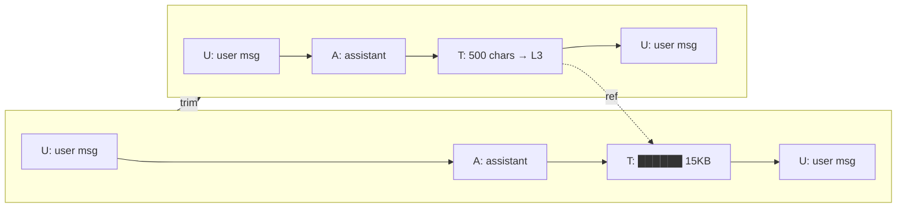

# Trim

```mermaid
flowchart LR
    subgraph orig[" "]
        direction TB
        o1[U: user msg]
        o2[A: assistant]
        o3["T: ██████ 15KB"]
        o4[U: user msg]
        o1 --> o2 --> o3 --> o4
    end

    subgraph trimmed[" "]
        direction TB
        t1[U: user msg]
        t2[A: assistant]
        t3["T: 500 chars → L3"]
        t4[U: user msg]
        t1 --> t2 --> t3 --> t4
    end

    orig -->|trim| trimmed
    t3 -.->|ref| o3
```
