# Session Trim Diagrams

## Trim (Simple)

Deterministic truncation of large tool outputs when context gets full.

```mermaid
flowchart LR
    subgraph original["Original Session (90% full)"]
        u1[User msg]
        a1[Assistant]
        t1["Tool output<br/>████████████<br/>████████████<br/>(15KB)"]
        u2[User msg]
        t2["Tool output<br/>████████████<br/>(8KB)"]
    end

    subgraph trimmed["Trimmed Session (45% full)"]
        u1t[User msg]
        a1t[Assistant]
        t1t["Tool: 500 chars...<br/>→ see L3 in parent"]
        u2t[User msg]
        t2t["Tool: 500 chars...<br/>→ see L5 in parent"]
    end

    original -->|trim| trimmed
    t1t -.->|ref| t1
    t2t -.->|ref| t2
```

## Smart Trim

AI-driven selective trimming that preserves important context.

```mermaid
flowchart LR
    subgraph original["Original Session (90% full)"]
        direction TB
        o1[User msg]
        o2["Tool output (12KB)"]
        o3["Assistant: key decision ✓"]
        o4[User msg]
        o5["Tool output (9KB)"]
        o6["Assistant: architecture note ✓"]
    end

    subgraph ai["🤖 AI Analysis"]
        direction TB
        analyze["• Identify safe-to-trim<br/>• Preserve key context<br/>• Keep decisions/rationale"]
    end

    subgraph smart["Smart Trimmed (40% full)"]
        direction TB
        s1[User msg]
        s2["Tool: summary → L2"]
        s3["Assistant: key decision ✓"]
        s4[User msg]
        s5["Tool: summary → L5"]
        s6["Assistant: architecture note ✓"]
    end

    original --> ai --> smart
```

## Comparison

| Aspect | Simple Trim | Smart Trim |
|--------|-------------|------------|
| Method | Truncate at N chars | AI analyzes content |
| Preserves | Nothing specific | Key decisions, rationale |
| Speed | Instant | ~10-30 seconds |
| Context savings | ~50% | ~50-60% |
| Intelligence | None | Context-aware |

## Session Lineage

Both approaches maintain **lineage** - a chain of parent references:

When the agent needs full context, it can traverse the lineage to find
the original content.
